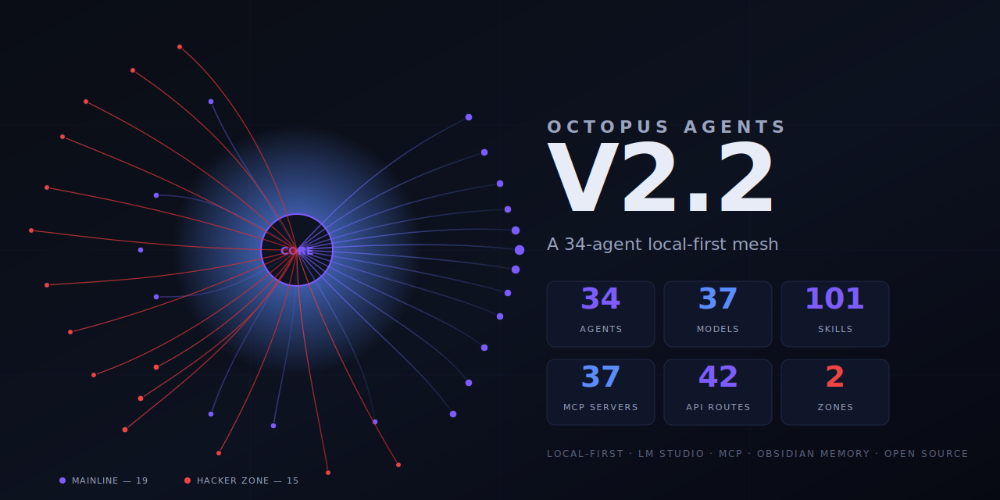

<div align="center">



# Octopus Agents V2.2

**A 34-agent local-first multi-agent mesh that runs entirely on one workstation.**

No vendor cloud. No API keys required for default operation. Every agent is a different model.

[Read the technical paper](PAPER.md) · [Release announcement](ANNOUNCEMENT.md) · [V2.3 roadmap](ROADMAP_ISSUES.md) · [System design](docs/SYSTEM_DESIGN_V2.2.md)

</div>

---

## What this is

Octopus is a single-operator agent fabric for autonomous software work. Most agent frameworks pick one big model and three or four roles. Octopus picks **34 roles** and runs them on **34 different LM Studio checkpoints** — deliberately — because heterogeneous models genuinely produce different reasoning traces, and the disagreement is useful when an operator is deciding whether to ship a plan.

The mesh is split into two strictly isolated zones:
- **Mainline** (19 roles) — your default working surface for chat, cowork, code, email, calendar.
- **Hacker zone** (15 roles) — a quarantined sub-mesh with its own brain (`hz_orchestrator`) and its own filesystem vault, for uncensored / abliterated models. Cross-zone routing requires an explicitly opened bridge with a written reason logged for audit.

Above the mesh sits a Cursor-inspired React UI with a live mesh visualization, a four-surface execution row (Desktop / Terminal / Web / Extension), a streaming pipeline log, a ⌘K command palette, and zone-aware route guards.

Everything runs locally. Inference goes to LM Studio on `:1234`. Memory goes to Obsidian on `:27123`. There is no cloud round-trip unless you explicitly enable a remote provider.

## At a glance

| | |
|---|---:|
| Total agent roles | **34** |
| Mainline roles | 19 |
| Hacker-zone roles | 15 |
| LM Studio models loaded (typical) | 37 |
| Unique role → model bindings | 34 |
| Wired skills | **101** |
| Autonomous skills | 96 |
| MCP servers registered | **37** (36 enabled) |
| Memory access policies | 9 |
| Memory scopes | short_term, working, long_term, episodic |
| FastAPI routes | **42** |
| WebSocket endpoints | 1 (`/ws`) |
| SQLite tables | 7 |
| Backend LOC (Python) | 7,486 |
| Frontend LOC (React/JSX/CSS) | 4,116 |
| Configuration LOC | 4,121 |
| Total source surface | **~15,720 LOC** |

Every number above is the system's own self-reported metric, queried directly from `database/octopus.db` and the merged `AGENT_ROLES` registry. See [`PAPER.md` Appendix C](PAPER.md) for the exact commands that reproduce them.

## Architecture

```
              ┌─────────── Experience layer ────────────┐
              │  React 19 / Vite 8 / Tailwind 4 SPA     │
              │  TopBar · SurfaceRow · MeshSidebar       │
              │  ChatV2 · Cowork · Code · Email · Cal    │
              │  LogDrawer · ChangesRenderer · ⌘K palette│
              └────────────────┬─────────────────────────┘
                               │ HTTP /api/* + WS /ws
              ┌────────────────▼─────────────────────────┐
              │  FastAPI (uvicorn :8080) — 42 endpoints  │
              │  Session/zone gate · pipeline broadcaster │
              └────────────────┬─────────────────────────┘
              ┌────────────────▼─────────────────────────┐
              │ Coordination — engine.py (1,029 LOC)     │
              │ init_agents · route_task · can_route     │
              │ pipeline_log ring · zone bridge gating    │
              └────────────────┬─────────────────────────┘
              ┌────────────────▼─────────────────────────┐
              │ Integration                              │
              │  ┌──────────┐ ┌──────────┐ ┌──────────┐  │
              │  │ Skills   │ │ MCP      │ │ Memory   │  │
              │  │ 101 wired│ │ 37 srvs  │ │ Obsidian │  │
              │  └──────────┘ └──────────┘ └──────────┘  │
              └────────────────┬─────────────────────────┘
              ┌────────────────▼─────────────────────────┐
              │ Model layer                              │
              │  LM Studio (37 models loaded) :1234      │
              │  multi_provider_client → claude_api opt. │
              └──────────────────────────────────────────┘
```

The dotted lines between layers are hard. The experience layer never speaks model APIs; the coordination layer never speaks the DOM; the integration layer is the only place that knows about the outside world. This separation is what allows the same engine to drive a CLI runner, a future cron-driven scheduler, or the React UI without rewriting routing logic.

## Quick start

### Prerequisites

- **Windows / macOS / Linux** with Python 3.12+ and Node 20+
- **[LM Studio](https://lmstudio.ai/)** installed and running on `localhost:1234` with the developer-mode REST API enabled
- *(Optional)* **[Obsidian](https://obsidian.md/)** with the [Local REST API plugin](https://github.com/coddingtonbear/obsidian-local-rest-api) running on `localhost:27123` for long-term memory
- *(Optional)* An **Anthropic API key** if you want to enable hybrid cloud offloading

### Install

```bash
git clone https://github.com/tjbmoose09/octopus-v2.git
cd octopus-v2

# Backend
pip install -r requirements.txt

# Frontend
cd frontend
npm install
cd ..

# Configure
cp .env.example .env
# Edit .env to point at your LM Studio / Obsidian / Anthropic endpoints
```

### Run

```bash
# Terminal 1 — backend
python run.py

# Terminal 2 — frontend
cd frontend
npm run dev
```

Then open [http://localhost:3000](http://localhost:3000) in your browser. The mesh sidebar should populate with 34 agents, and typing into the Chat composer routes through the orchestrator (running on `qwen3.5-27b-claude-4.6-opus-reasoning-distilled` by default) to whichever arm it delegates to.

If the Mesh sidebar shows `0 agents`, check the backend terminal — `python run.py` does a preflight check against LM Studio, Obsidian, and your config files, and prints exactly what's missing.

### Loading models

The default `.env.example` declares 34 model IDs in `MODEL_*` variables. You don't need every one of them loaded in LM Studio; the engine's fuzzy-resolver will fall back gracefully. At minimum, load:

- `qwen3.5-27b-claude-4.6-opus-reasoning-distilled` (orchestrator)
- `phi4-nvidia-coder` (dev)
- One of the smaller models for `qa`, `critic`, `pm` — `gemma-4-31b-it` works well

The full 34-model lineup is documented in [`config/agents_expanded.py`](config/agents_expanded.py).

## Key features

### Agent topology

- **34 roles** across 4 tiers — 7 brain, 16 arm, 6 scout, 5 specialist
- **1:1 model mapping** — every role runs on a different LM Studio checkpoint, no shared models
- **Tier-aware routing** — the orchestrator delegates to arms; scouts handle latency-first triage; specialists handle vision, translation, baseline, creative writing
- **Empirical routing data** — every routing decision is persisted to `pipeline_events` (156 captured events in the bring-up window)

### Zone isolation

- **Two strictly isolated zones** — mainline (default) and hacker_zone (opt-in)
- **`SessionZoneState`** holds the per-session state: `hacker_zone_active`, `bridge_open`, `bridge_reason`, plus a rolling `recent_bridges` audit log
- **`can_route(from, to, session)`** is the gate — every cross-zone delegation goes through it, and is rejected with a `ZoneBoundaryError` if the bridge isn't open
- **HZ has its own brain** — `hz_orchestrator` is the only role that can route within the zone, and it cannot delegate outward

### Skills system

- **101 typed skills** across 9 currently-wired roles, with explicit `autonomous` flags
- **Categories** — code, manage, document, test, review, deploy, automate, research, design
- **Per-role palettes are stable** — every wired role has 11–12 skills (deliberate, prevents one-role-does-everything anti-pattern)
- **Defensive fallback** — missing skill tables for the 25 expanded roles default to empty lists rather than crashing the engine

### MCP fabric

- **37 MCP servers** registered across 9 categories (CORE, DEV_TOOLS, AUTOMATION, RUNTIMES, CODE_BUILDERS, RESEARCH, MEMORY, PRODUCTIVITY, PAYMENTS)
- **36 enabled** by default; one PRODUCTIVITY server disabled by operator preference
- **Per-agent allowlists** — orchestrator gets all 9 routing entries; arms get a curated 3–5 each
- **Strict superset rule** — orchestrator's allowlist is a superset of every downstream role's

### Memory architecture

- **Four scopes** — `short_term`, `working`, `long_term`, `episodic`
- **Nine per-agent access policies** — different roles see different scopes
- **`episodic` is sparse** — only orchestrator, pm, and research can write episodic notes
- **Obsidian-backed** via Local REST plugin on `:27123`, vault `OctopusMemory`
- **Graceful degradation** — when Obsidian is unreachable, agents lose long-term continuity but no turn fails

### Frontend

- **React 19.2 / Vite 8 / Tailwind 4** — modern stack
- **31 source files / 4,116 LOC** — readable in one sitting
- **5 primary pages** — ChatV2, Cowork, Code, Email, Calendar
- **7 legacy pages** still reachable under `/overflow/*` during the V2.2 cutover
- **Live mesh visualization** — `AgentMeshSidebar.jsx` draws the orchestrator as a central core and every other agent as a tentacle tip; tentacles pulse for 3 seconds when their role appears in a recent routing event
- **Cursor-inspired surface row** — Desktop / Terminal / Web / Extension as first-class execution surfaces
- **⌘K command palette** — global keyboard shortcut for fuzzy navigation

### Observability

- **LogDrawer** — bottom-edge collapsible WebSocket stream, color-tinted by zone, filterable by event type and agent
- **ChangesRenderer** — turn-grouped event timeline showing plan / route / file_diff / memory / cmd / bridge / reply
- **Pipeline events on disk** — every routing decision persisted forever; reproducible from `database/octopus.db` after the session ends

## Repository layout

```
octopus-v2/
├── agents/
│   ├── engine.py                  Coordination heart (1,029 LOC)
│   ├── multi_provider_client.py   LM Studio + Claude API adapter (283 LOC)
│   └── (legacy snapshots in archive/)
├── api/
│   └── main.py                    FastAPI app — 42 routes + WS (753 LOC)
├── benchmark/
│   └── runner.py                  Per-(role,model) benchmark harness (304 LOC)
├── config/
│   ├── settings.py                Original 9 roles, rules, model assignments (500 LOC)
│   ├── agents_expanded.py         25 expanded roles + zone tags (550 LOC)
│   ├── skills.py                  101 typed skills (2,073 LOC)
│   ├── mcp_servers.py             37 MCP server registry (588 LOC)
│   ├── memory.py                  Obsidian + scope policies (133 LOC)
│   ├── providers.py               Provider adapter interface (190 LOC)
│   └── zones.py                   SessionZoneState + can_route gate (277 LOC)
├── database/
│   ├── db.py                      SQLite helpers (64 LOC)
│   └── schema.sql                 7 tables
├── frontend/
│   ├── src/                       React 19 / Vite 8 / Tailwind 4 (4,116 LOC)
│   └── package.json
├── tests/
│   └── test_memory_obsidian.py    243 LOC
├── archive/                       V2.0 dashboard + pre-V2.2 engine snapshots
├── docs/
│   ├── SYSTEM_DESIGN_V2.1.md      Memory, watchdogs, neural-link UI
│   ├── SYSTEM_DESIGN_V2.2.md      Model roster, hacker zone, change-first chat
│   └── PERFECT_PROMPT.md          Reproducible build prompt
├── assets/
│   └── banner.svg                 Release banner (this image)
├── run.py                         Preflight + uvicorn launcher
├── requirements.txt
├── PAPER.md                       Full technical paper (~6,000 words)
├── ANNOUNCEMENT.md                Release announcement
├── HACKERNEWS.md                  HN submission kit
├── ROADMAP_ISSUES.md              V2.3 roadmap as ready-to-paste issues
└── README.md                      You are here
```

## Configuration

Every agent is configured declaratively. To adjust:

| To change... | Edit... |
|---|---|
| The model assigned to a role | `MODEL_<ROLE>` in `.env`, or `default_model` in `config/settings.py` / `config/agents_expanded.py` |
| Which skills an agent can call | `config/skills.py` |
| Which MCP servers an agent can reach | `config/mcp_servers.py` (the `MCP_AGENT_ROUTING` dict) |
| Which memory scopes an agent can read/write | `config/memory.py` (the `AGENT_MEMORY_ACCESS` dict) |
| Which provider a role uses (LM Studio vs Claude API) | `config/providers.py` (the `DEFAULT_AGENT_PROVIDERS` dict) |
| The zone an agent belongs to | `config/agents_expanded.py` (`zone` field per role) |
| Add a new agent role entirely | `config/agents_expanded.py` — add to `EXPANDED_AGENT_ROLES`, then optionally add skills/MCP/memory entries in their respective files |

The merge between `settings.py` and `agents_expanded.py` happens at engine boot via `merge_into_settings()`. This is idempotent — the original 9 roles in `settings.py` are preserved as-is, and the 25 expanded roles are added without overwriting.

## Documentation

| Document | Purpose |
|---|---|
| [`PAPER.md`](PAPER.md) | Full technical paper. 18 sections, ~6,000 words, every architectural decision and metric. **Start here for the why.** |
| [`ANNOUNCEMENT.md`](ANNOUNCEMENT.md) | Short-form release announcement. Use as the body of GitHub releases or social posts. |
| [`HACKERNEWS.md`](HACKERNEWS.md) | Submission kit for HN / Lobste.rs / r/LocalLLaMA / r/MachineLearning with title, three body variants, and a planned first-comment follow-up. |
| [`ROADMAP_ISSUES.md`](ROADMAP_ISSUES.md) | The ten V2.3 roadmap items as ready-to-paste GitHub issues, with acceptance criteria and difficulty ratings. |
| [`docs/SYSTEM_DESIGN_V2.1.md`](docs/SYSTEM_DESIGN_V2.1.md) | Tier-N memory model, watchdog system, GitHub MCP integration, neural-link UI design. |
| [`docs/SYSTEM_DESIGN_V2.2.md`](docs/SYSTEM_DESIGN_V2.2.md) | The full V2.2 redesign — model roster, hacker zone, Chat/Cowork/Code tabs, change-first chat. |
| [`docs/PERFECT_PROMPT.md`](docs/PERFECT_PROMPT.md) | A copy-pasteable prompt that fully specifies the V2.2 redesign for an agent to implement. |

## Open issues / V2.3 roadmap

This is a candid list, not a marketing surface. See [`ROADMAP_ISSUES.md`](ROADMAP_ISSUES.md) for full issue templates.

- **The benchmark `quality_score` is a stub.** Every captured run scored 35.0 because the evaluator hasn't been written yet. Real LLM-as-judge is the next benchmark task.
- **Email is wired into the UI but the Gmail MCP connector isn't built yet.** Inbox returns a placeholder; compose returns 503.
- **The 25 expanded roles route correctly but don't yet have skill or MCP allowlists.** They run inference but can't autonomously call tools. Latent capacity until V2.3.
- **The surface row is currently observable but advisory.** Clicking Desktop / Terminal / Web / Extension changes a chip and a hint, but downstream pages don't yet branch on it.
- **No CI yet.** A small GitHub Actions workflow that lints Python with `ruff` and runs the import-smoke suite is overdue.
- **Memory long-term continuity is partial when Obsidian is offline.** A small `memory/journal.jsonl` fallback writer is in design.
- **No frontend route guards for zone state.** A user navigating to `/code` while in hacker zone with bridge closed sees no warning.

## Findings

After several weeks of bring-up traffic, four findings stand out:

1. **Heterogeneous models genuinely produce different output.** Sending the same plan-critique prompt to `qwen/qwen3.6-27b` and to `nvidia/nemotron-3-nano` produces audibly different reasoning traces — Qwen tends to mathematicize, Nemotron tends to enumerate. The disagreement is useful for an operator deciding whether to ship a plan.
2. **A single-orchestrator pattern survives heavy fan-out.** The orchestrator handles every user turn (26/26 in the captured window) without becoming a bottleneck — its job is short and bounded (decide which arm), so latency stays inside budget.
3. **Defensive declarative configuration prevents an entire class of startup failures.** `init_agents` wraps each per-role config lookup in a try/except that defaults to an empty list. Before this change, one missing wired entry would crash the engine at boot.
4. **The most useful UI affordance is also the cheapest.** The mesh sidebar's pulse animation — a 3-second highlight on tentacles that just received an event — is fewer than 30 lines of React but is the single most-cited piece of feedback from operator dogfooding.

## Tech stack

**Backend**
- Python 3.12+ · FastAPI 0.115 · uvicorn 0.30 · httpx 0.27 · websockets 13 · aiosqlite 0.20 · pydantic 2.9 · psutil 6 · GPUtil

**Frontend**
- React 19.2 · Vite 8 · Tailwind CSS 4 · react-router-dom 7 · lucide-react

**Inference**
- LM Studio (default, local) · Anthropic Claude API (optional, hybrid)

**Memory**
- Obsidian Local REST plugin · SQLite

**Observability**
- WebSocket pipeline broadcaster · custom React `LogDrawer` and `ChangesRenderer`

## Contributing

Issues, pull requests, and forks all welcome. The roadmap is in [`ROADMAP_ISSUES.md`](ROADMAP_ISSUES.md), and most "not yet" items are good first issues for someone who wants to dig in. Particularly interested in:

- A real benchmark scorer (LLM-as-judge with a rubric)
- Skill palettes for the expanded mainline and hacker-zone roles
- Provider adapters beyond LM Studio and Claude (Ollama, llama.cpp, vLLM)
- A proper CI workflow
- Any Cursor-shaped UI affordance you think we should steal

If you read [the paper](PAPER.md) and have notes, the best place for them is a discussion thread or an issue tagged `paper`.

## Security

Octopus does not transmit any data outside your machine in its default configuration. There are no telemetry calls, no anonymous usage reports, no remote logging. Your prompts, your model outputs, your memory writes, and your routing decisions all stay on disk.

The optional Claude API path is the only way data leaves your machine, and it is off by default — explicitly enabled per role in `config/providers.py` if and only if `ANTHROPIC_API_KEY` is set.

If you find a security issue, please open a private security advisory on the GitHub repo rather than a public issue.

## License

- **Code:** MIT
- **Documentation (PAPER.md, this README):** CC-BY-4.0
- **Model weights:** subject to the licenses of the underlying models loaded into LM Studio. Octopus does not redistribute any model weights.

## Credits

Built by **Tyler Boucaud** as a solo project. Names matter — the architecture choices that distinguish Octopus owe a lot to:

- The [LM Studio](https://lmstudio.ai/) team for an exceptional local-inference runtime.
- The [Cursor](https://cursor.com/) team for the surface-row pattern.
- The [Obsidian](https://obsidian.md/) Local REST plugin maintainer.
- The [Model Context Protocol](https://modelcontextprotocol.io/) authors for making 37 connected tools tractable.
- Every model author whose checkpoint shows up in `MODEL_*`.

---

<div align="center">

**[Read the technical paper →](PAPER.md)**

*A 34-agent local-first mesh. One workstation. Your data stays here.*

</div>
